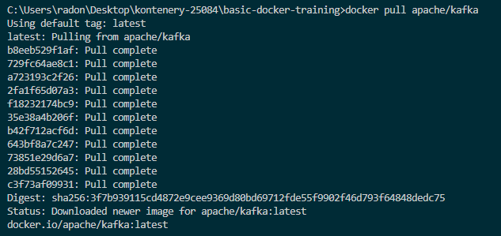
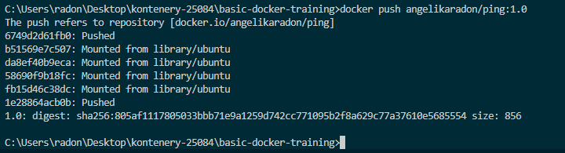

# Ćwiczenie 4 – Udostępnianie obrazów


### Logowanie do Docker Hub
Pobranie obrazu systemu Ubuntu w wersji 16.04 z DockerHub.

**Polecenie:**
```bash
docker login
```


### Szukanie obrazów
**Polecenie:**
```bash
docker search kafka
```


### Pobranie przykładowego obrazu
**Polecenie:**
```bash
docker pull apache/kafka
```


### Sprawdzenie lokalnych obrazów
**Polecenie:**
```bash
docker images
```


###  Usunięcie tagu obrazu ping
**Polecenie:**
```bash
docker rmi radon/ping

```


### Tagowanie obrazu własnym Docker ID i wysłanie obrazu do Docker Hub
**Polecenie:**
```bash
docker tag 805af1117805 angelikaradon/ping:1.0
docker push angelikaradon/ping:1.0

```



