# Docker for Beginners - Linux

## Przygotowanie środowiska
**Polecenie:**
```bash
git clone https://github.com/ibnesayeed/linkextractor.git
cd linkextractor
git checkout demo

```


## Task 0
### Basic Link Extractor Script
### Przełącza repo na wersję bez Dockera.
**Polecenie:**
```bash
git checkout step0
```
### Pokazuje strukturę katalogów i plików
**Polecenie:**
```bash
tree
```
### Wyświetla prosty skrypt Pythona do wyciągania linków
**Polecenie:**
```bash
cat linkextractor.py
```
### Próba uruchomienia skryptu jako programu (błąd uprawnień)
**Polecenie:**
```bash
./linkextractor.py http://example.com/
ls -l linkextractor.py

```
### Uruchamia skrypt interpreterem Python (błąd: brak bibliotek)
**Polecenie:**
```bash
python3 linkextractor.py http://example.com/

```


## Task 1
### Przechodzi do wersji z Dockerfile.
**Polecenie:**
```bash
git checkout step1
```
**Polecenie:**
```bash
tree
```
**Polecenie:**
```bash
cat Dockerfile

```


### Buduje obraz Dockera 
**Polecenie:**
```bash
docker image build -t linkextractor:step1 .
```

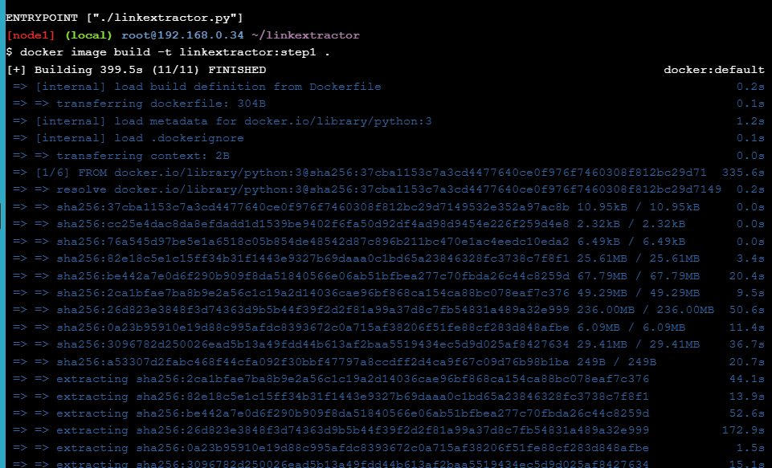


**Polecenie:**
```bash
docker image ls

```


### Uruchamia kontener jednorazowo i usuwa go po zakończeniu
**Polecenie:**
```bash
docker container run -it --rm linkextractor:step1 http://example.com/

```


### Testuje skrypt na stronie z wieloma linkami

**Polecenie:**
```bash
docker container run -it --rm linkextractor:step1 https://training.play-with-docker.com/

```


## Task 2
### Pełne URL + tekst linków

**Polecenie:**
```bash
git checkout step2

cat linkextractor.py
```
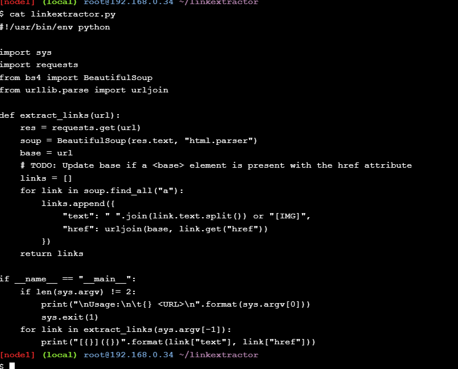

### Budowanie nowego obrazu

**Polecenie:**
```bash
docker image build -t linkextractor:step2 .
```


**Polecenie:**
```bash
docker image ls
```


### Pokazuje współistniejące wersje obrazów

**Polecenie:**
```bash
docker container run -it --rm linkextractor:step2 https://training.play-with-docker.com/
```


### Potwierdza, że stara wersja nadal działa

**Polecenie:**
```bash
docker container run -it --rm linkextractor:step1 https://training.play-with-docker.com/

```


## Task 3

### API Service (Flask)

**Polecenie:**
```bash
git checkout step3
tree
```


**Polecenie:**
```bash
cat Dockerfile

```


### Dockerfile uruchamia teraz main.py (serwer Flask)

**Polecenie:**
```bash
cat main.py

```
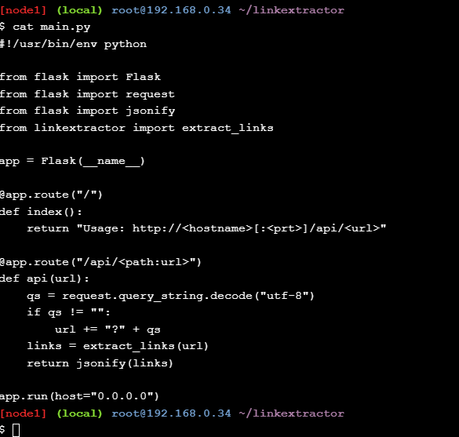

### Buduje obraz API

**Polecenie:**
```bash
docker image build -t linkextractor:step3 .

```
**Polecenie:**
```bash
docker container run -d -p 5000:5000 --name=linkextractor linkextractor:step3

```
**Polecenie:**
```bash
docker container ls

```
**Polecenie:**
```bash
curl -i http://localhost:5000/api/http://example.com/

```
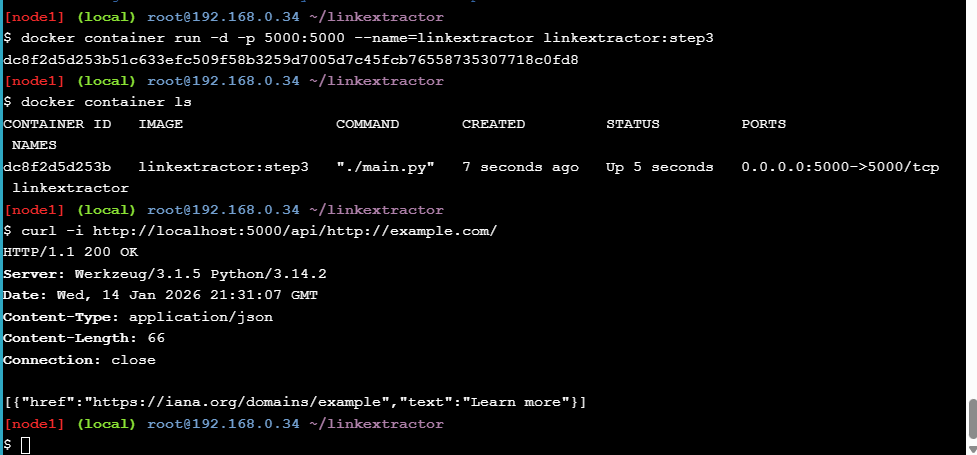

### Wyświetla logi serwera Flask 
**Polecenie:**
```bash
docker container logs linkextractor
```


### Zatrzymuje i usuwa kontener API
**Polecenie:**
```bash
docker container rm -f linkextractor
```


## Task 4 
### API + Web Frontend (PHP) + Docker Compose

**Polecenie:**
```bash
git checkout step4
tree
```
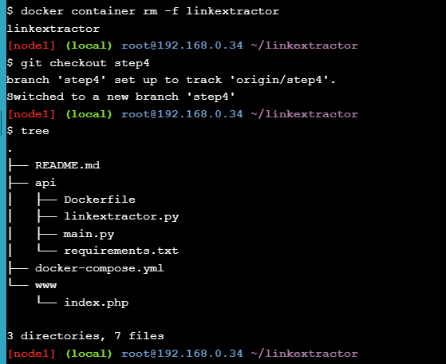


**Polecenie:**
```bash
cat docker-compose.yml
```


### Podmiana pliku strony  

**Polecenie:**
```bash
cat docker-compose.yml
cat www/index.php
docker-compose up -d --build

```


### Sprawdza działające serwisy
**Polecenie:**
```bash
curl -i http://localhost:5000/api/http://example.com/
```

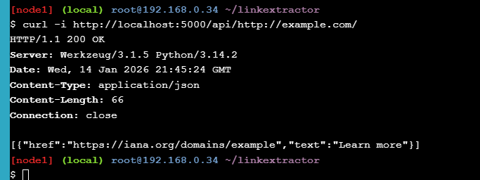


## Task 5

### Redis Cache + self-contained images

**Polecenie:**
```bash
Redis Cache + self-contained images
```

**Polecenie:**

```bash
cat www/Dockerfile

```
**Polecenie:**

```bash
cat api/main.py

```


**Polecenie:**

```bash
docker-compose up -d --build

```
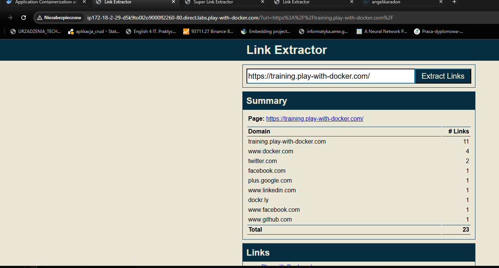

**Polecenie:**

```bash
sed -i 's/Link Extractor/Super Link Extractor/g' www/index.php

```

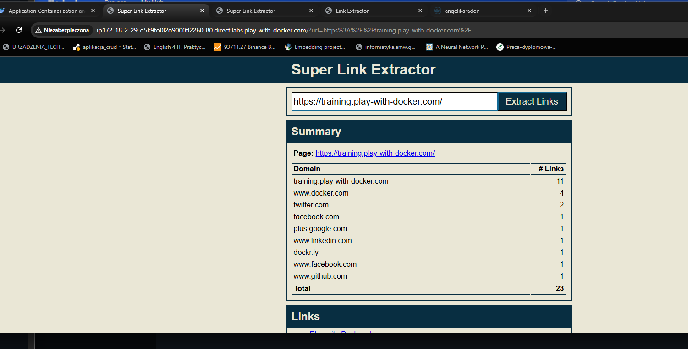

**Polecenie:**

```bash
git reset --hard
docker-compose down

```


## Task 6

### Zamiana API Python → Ruby

**Polecenie:**

```bash
git checkout step6
cat api/linkextractor.rb
cat docker-compose.yml
docker-compose up -d --build

```
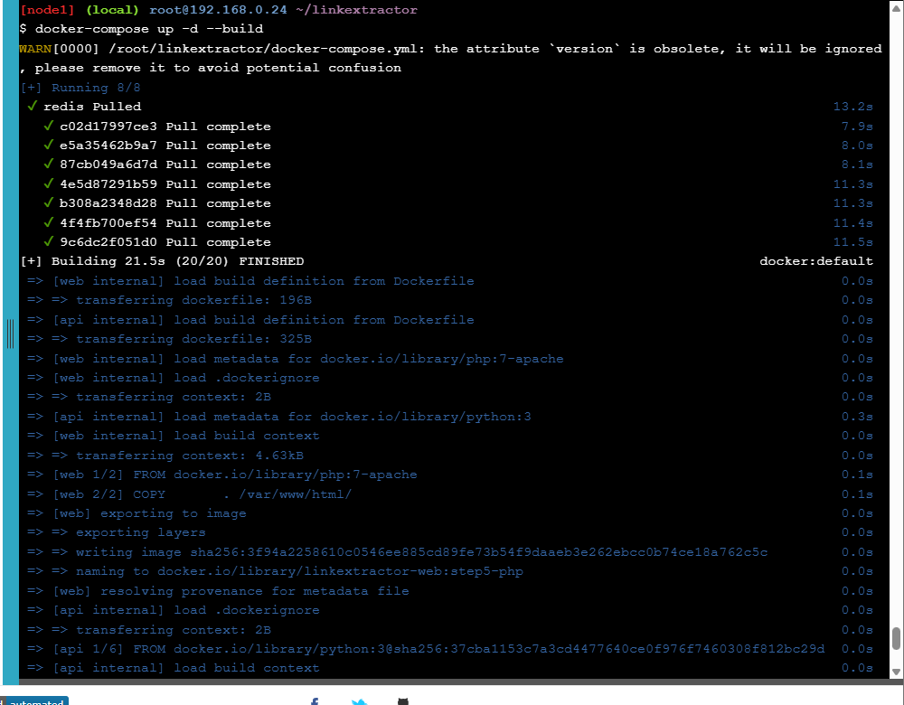


**Polecenie:**

```bash
curl -i http://localhost:4567/api/http://example.com/

```
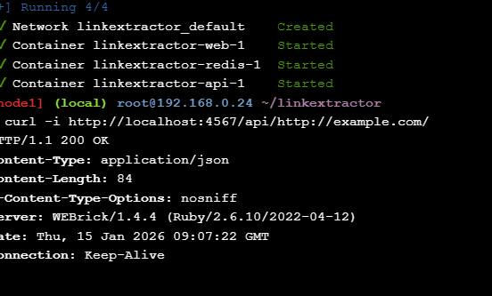

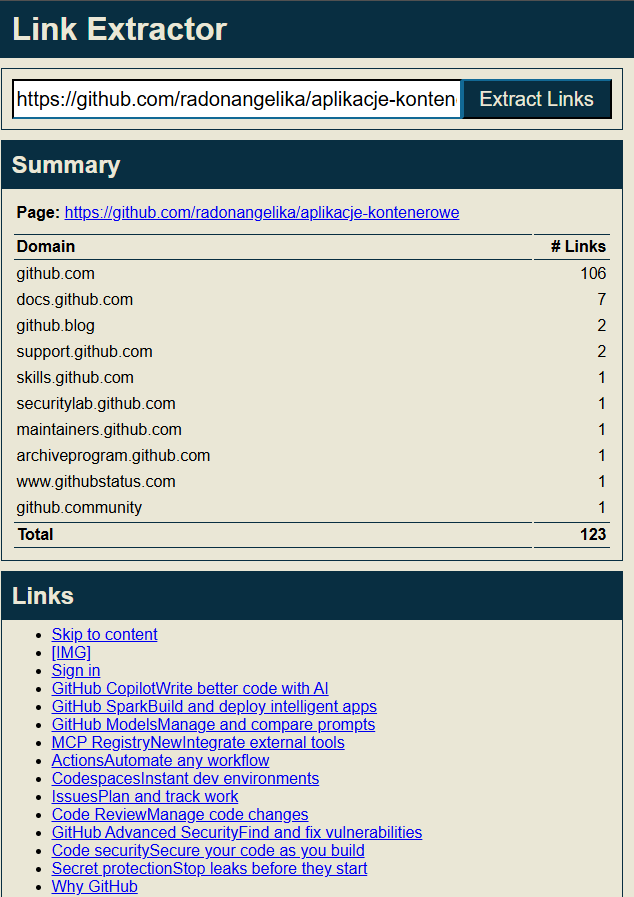

**Polecenie:**

```bash
docker-compose down
cat logs/extraction.log


```
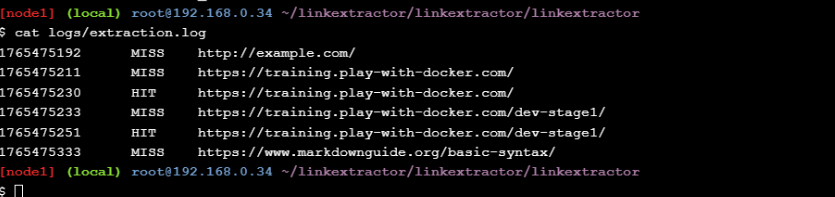
