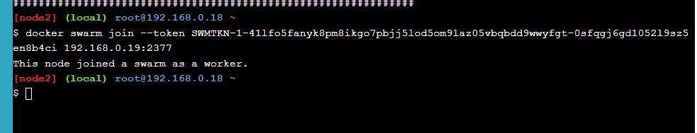
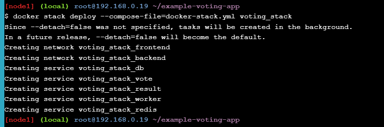
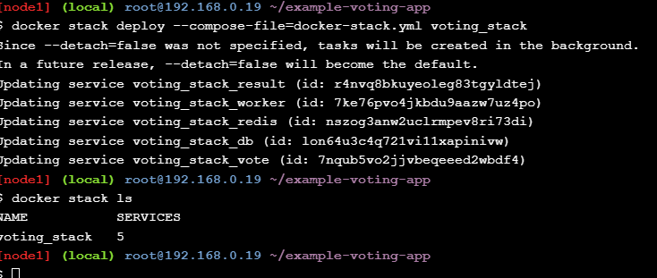
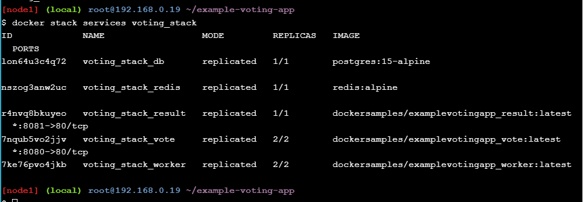
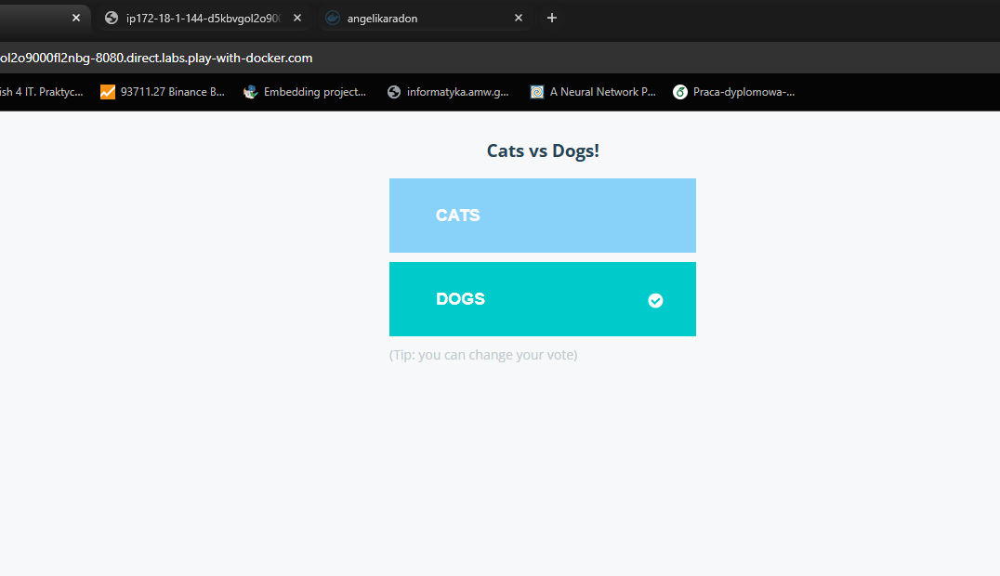

# Deploying a Multi-Service App in Docker Swarm Mode

## Task 1
### Terminal 1
**Polecenie:**
```bash
docker swarm init --advertise-addr $(hostname -i)


```


## Terminal 2
**Polecenie:**
```bash
docker swarm join --token SWMTKN-1-41lfo5fanyk8pm8ikgo7pbjj5lod5om9laz05vbqbdd9wwyfgt-0sfgqj6gd105219sz5en8b4ci 192.168.0.19:2377

```


## Task 2
## Terminal 1
### Sprawdzenie członków Swarm 
**Polecenie:**
```bash
docker node ls
```


## Task 3
### Pobieranie kod Voting App
**Polecenie:**
```bash
git clone https://github.com/docker/example-voting-app
```


## Task 4 
### Wdróż stack (deploy aplikacji w Swarm)**Polecenie:**
```bash
docker stack deploy --compose-file=docker-stack.yml voting_stack
```



## Task 5
### Sprawdź, czy stack działa

**Polecenie:**
```bash
docker stack ls

```





## Task 6

### Sprawdź rozmieszczenie replik (tasks) serwisu vote
**Polecenie:**
```bash
docker service ps voting_stack_vote

```


### Sprawdzenie


