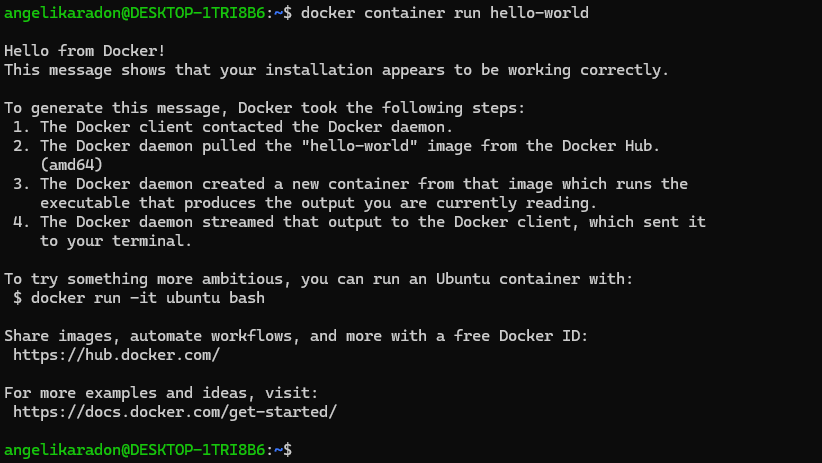
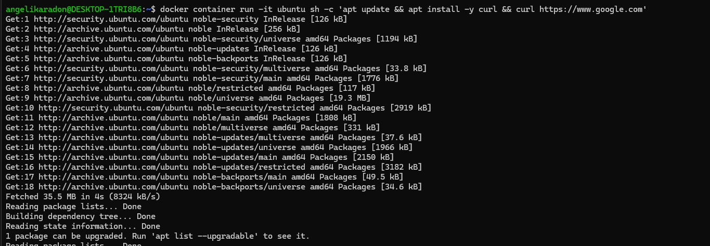
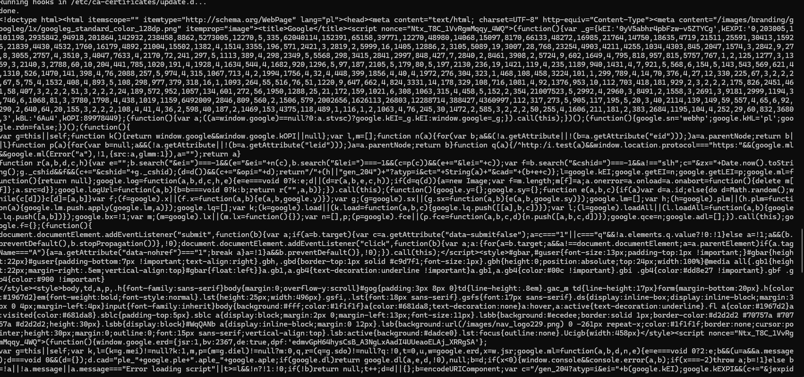
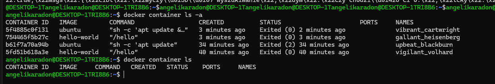
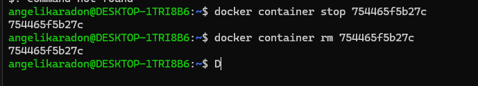
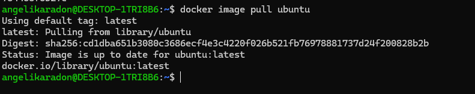
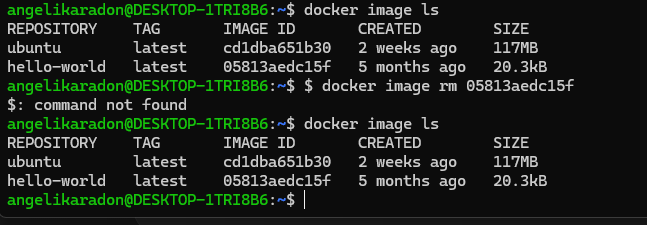

# Devops with Docker
## section 1

### Sprawdzenie instalacji Dockera, uruchomienie testowego obrazu 'hello word'
**Polecenie:**
```bash
docker container run hello-world
```


### Uruchomienie kontenera Ubuntu i instalacja narzędzi
**Polecenie:**
```bash
docker container run -it ubuntu sh -c "apt update && apt install -y curl && curl https://www.google.com"
```



### Wyświetlenie listy kontenerów
**Polecenie:**
```bash
docker container ls -a
```




### Usunięcie niepotrzebnego kontenera
**Polecenie:**
```bash
git clone https://github.com/dodocker container stop <ID_kontenera>
docker container rm <ID_kontenera>
```



### Pobranie obrazu Ubuntu
**Polecenie:**
```bash
docker image pull ubuntu
```



### Wyświetlenie listy obrazów

**Polecenie:**
```bash
docker image ls
```





