# section 2

## Uruchomienie testowego kontenera

**Opis:**  
Sprawdzenie poprawności instalacji Dockera poprzez uruchomienie obrazu testowego.

**Polecenie:**
docker container run hello-world

---
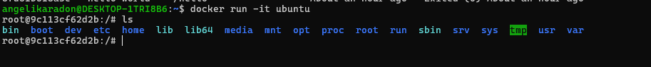

## Uruchomienie Ubuntu w trybie interaktywnym

**Opis:**  
Uruchomiono kontener z systemem Ubuntu i sprawdzono jego system plików.

**Polecenie:**
docker run -it ubuntu
ls /
exit

---
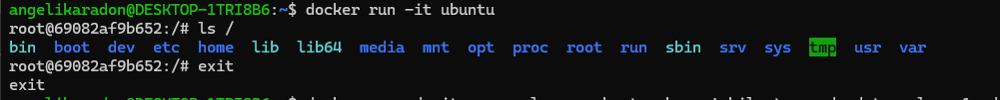

## Uruchomienie kontenera działającego w tle – looper

**Opis:**  
Utworzono kontener o nazwie *looper*, który w nieskończonej pętli wypisuje aktualną datę.

**Polecenie:**
docker run -d -it --name looper ubuntu sh -c "while true; do date; sleep 1; done"

---
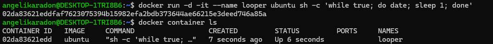

## Sprawdzenie działających kontenerów

**Opis:**  
Wyświetlono listę aktualnie uruchomionych kontenerów.

**Polecenie:**
docker container ls

---
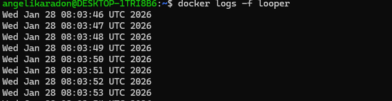

## Podgląd logów kontenera

**Opis:**  
Wyświetlono strumień wyjścia programu działającego w kontenerze *looper*.

**Polecenie:**
docker logs -f looper

---
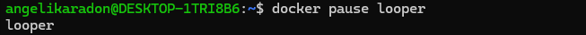

## Wstrzymanie i wznowienie kontenera

**Opis:**  
Tymczasowo zatrzymano wykonywanie procesu w kontenerze, a następnie wznowiono jego działanie.

**Polecenie:**
docker pause looper
docker unpause looper

---
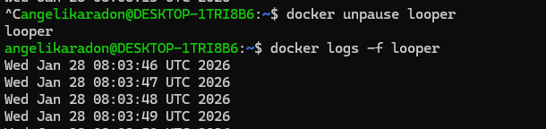

## Dołączenie do działającego kontenera

**Opis:**  
Podłączono terminal do procesu uruchomionego w kontenerze.

**Polecenie:**
docker attach looper

---
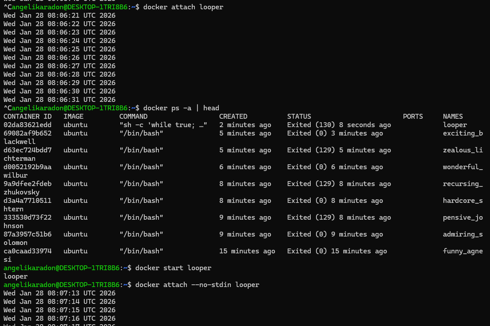

## Wyświetlenie wszystkich kontenerów

**Opis:**  
Sprawdzono również kontenery, które zakończyły działanie.

**Polecenie:**
docker ps -a

---
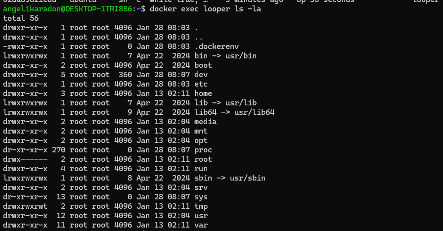

## Ponowne uruchomienie kontenera

**Opis:**  
Uruchomiono wcześniej zatrzymany kontener i ponownie podłączono się do jego wyjścia.

**Polecenie:**
docker start looper
docker attach --no-stdin looper

---
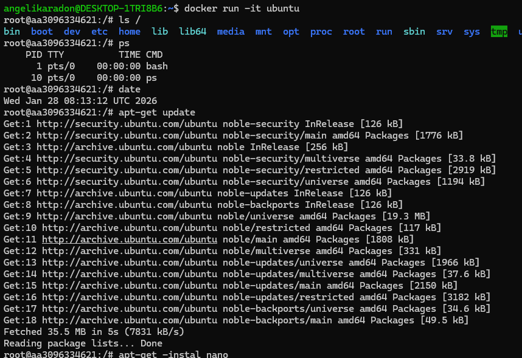

##  Wykonanie polecenia w działającym kontenerze

**Opis:**  
Bez przerywania działania kontenera wykonano polecenie listujące pliki.

**Polecenie:**
docker exec looper ls -la

---
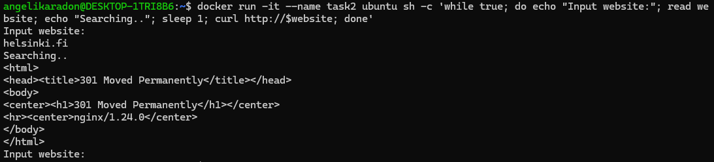

##  Instalacja oprogramowania w Ubuntu

**Opis:**  
W nowym kontenerze zainstalowano edytor nano.

**Polecenie:**
docker run -it ubuntu
apt-get update
apt-get install nano

---
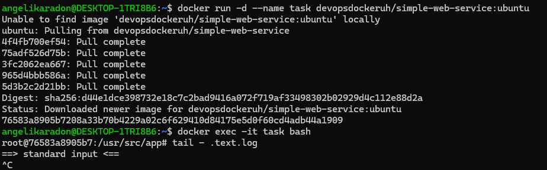

## Interaktywny skrypt pobierający stronę WWW

**Opis:**  
Utworzono kontener proszący użytkownika o adres strony, a następnie pobierający jej zawartość.

**Polecenie:**
docker run -it --name task2 ubuntu sh -c 'while true; do echo "Input website:"; read website; echo "Searching..."; sleep 1; curl http://$website; done'

---
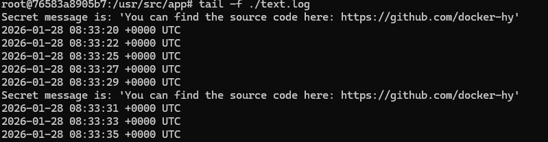
