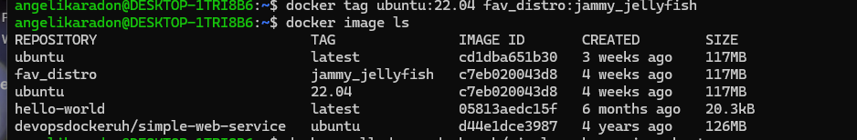
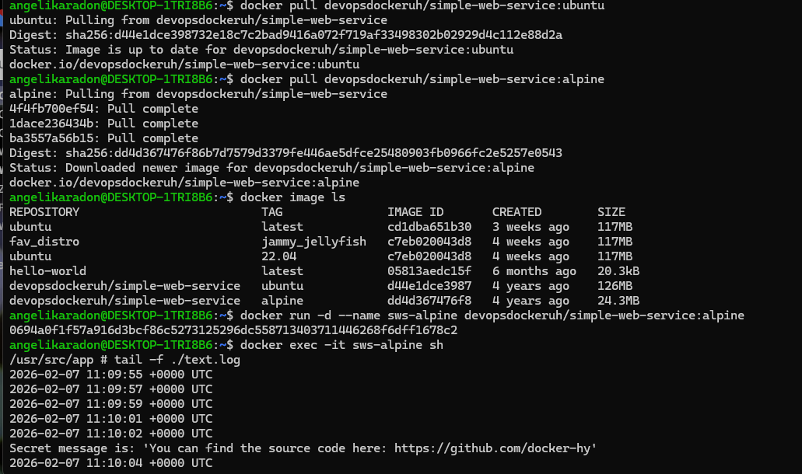
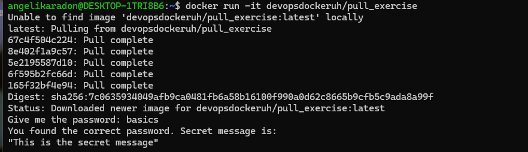

# section 3

## Ćwiczenie 1.5 – Porównanie obrazów Ubuntu i Alpine

**Opis:**  
Pobrano dwa obrazy tej samej aplikacji `simple-web-service` – wersję opartą o Ubuntu oraz Alpine Linux.  
Porównano ich rozmiary oraz sprawdzono działanie „sekretnej wiadomości”.

**Polecenia:**
```bash
docker pull devopsdockeruh/simple-web-service:ubuntu
docker pull devopsdockeruh/simple-web-service:alpine
docker image ls
```

**Uruchomienie wersji Alpine i odczyt logów:**
```bash
docker run -d --name sws-alpine devopsdockeruh/simple-web-service:alpine
docker exec -it sws-alpine sh
tail -f ./text.log
```

**Wynik:**  
W logach pojawia się komunikat:

> Secret message is: 'You can find the source code here: https://github.com/docker-hy'

**Zrzuty ekranu:**  
-   
- 

**Wniosek:**  
Wersja Alpine ma znacznie mniejszy rozmiar niż Ubuntu, ale funkcjonalnie działa identycznie.

---

## Ćwiczenie 1.6 – Hello Docker Hub

**Opis:**  
Uruchomiono kontener wymagający podania hasła. Na podstawie dokumentacji Docker Hub wpisano poprawną wartość.

**Polecenie:**
```bash
docker run -it devopsdockeruh/pull_exercise
```

**Podane hasło:**
```
basics
```

**Wynik:**
> "This is the secret message"

**Zrzut ekranu:**  
- 

---

## Ćwiczenie 1.7 – Budowa obrazu „curler”

**Opis:**  
Utworzono własny obraz na bazie `ubuntu:22.04`, zainstalowano curl i dodano skrypt pytający o adres strony WWW.

**Dockerfile:**
```dockerfile
FROM ubuntu:22.04
RUN apt-get update && apt-get install -y curl
WORKDIR /usr/src/app
COPY script.sh .
RUN chmod +x script.sh
CMD ./script.sh
```

**Budowanie i uruchomienie:**
```bash
docker build . -t curler
docker run -it curler
```

**Test działania:**
```
Input website:
helsinki.fi
Searching..
```

**Zrzuty ekranu:**  
-   
- 

---

## Ćwiczenie 1.8 – Two line Dockerfile (web-server)

**Opis:**  
Utworzono minimalny Dockerfile oparty o `simple-web-service:alpine`.  
Za pomocą CMD przekazano argument `server`, aby aplikacja startowała jako serwer HTTP.

**Dockerfile:**
```dockerfile
FROM devopsdockeruh/simple-web-service:alpine
CMD ["server"]
```

**Budowanie i uruchomienie:**
```bash
docker build . -t web-server
docker run web-server
```

**Wynik:**  
> [GIN-debug] Listening and serving HTTP on :8080

**Zrzuty ekranu:**  
-   
- 

---

## Wnioski

- Obrazy Docker mogą być budowane na różnych bazach (Ubuntu/Alpine), co wpływa głównie na rozmiar.  
- Dockerfile pozwala w powtarzalny sposób tworzyć własne obrazy.  
- CMD umożliwia definiowanie domyślnego zachowania kontenera.  
- Kontenery pozwalają uruchamiać aplikacje bez instalacji zależności w systemie hosta.
