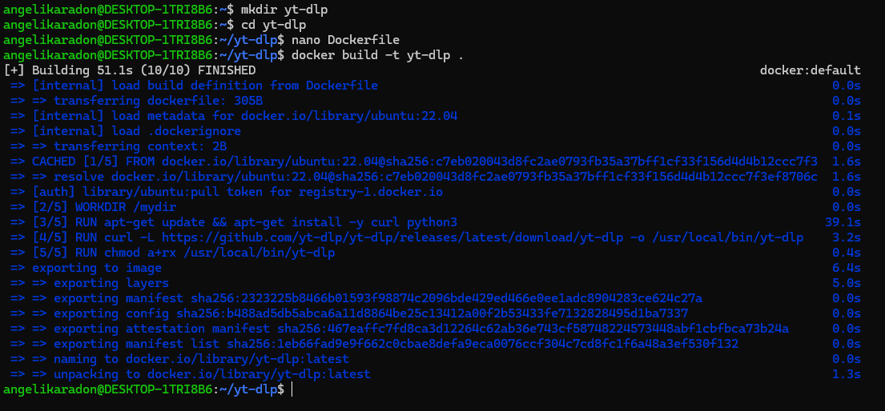
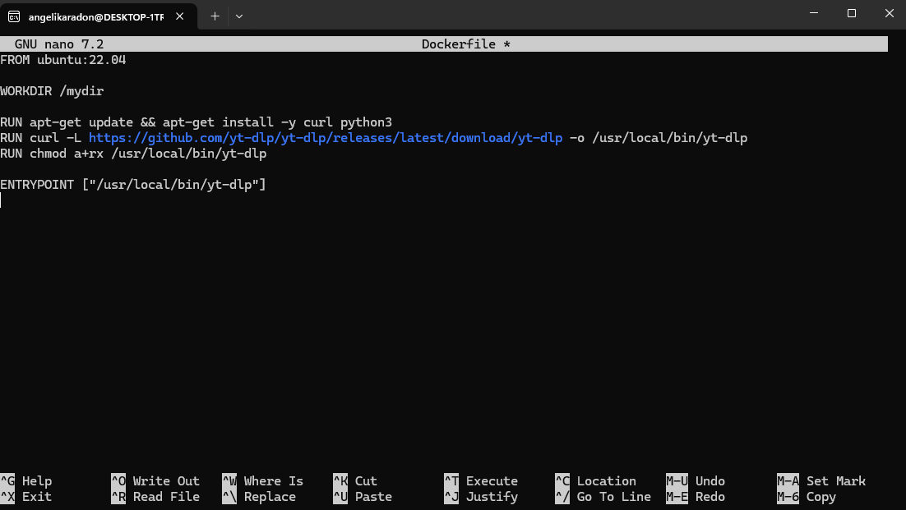
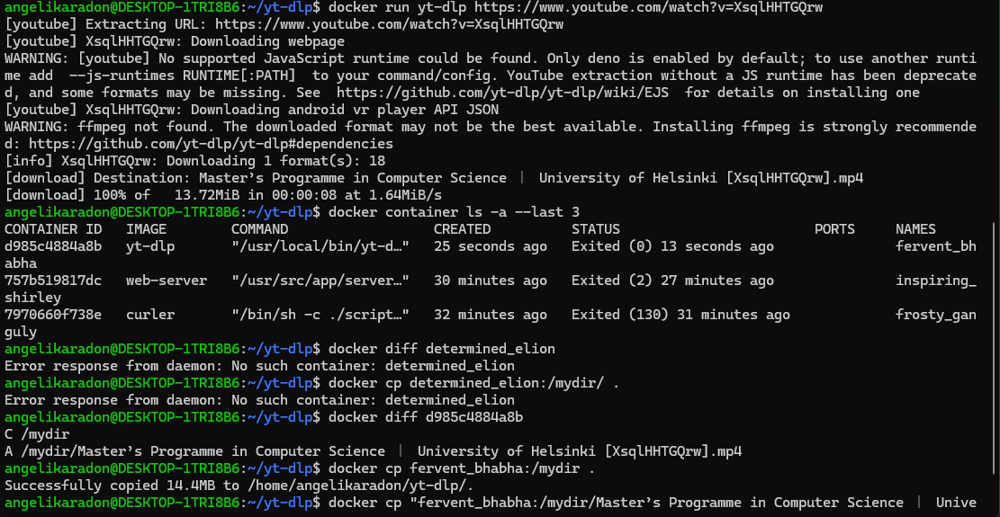

## Zadanie: yt-dlp – budowa własnego obrazu i kopiowanie pliku z kontenera

**Opis:**  
Utworzono własny obraz Docker na bazie `ubuntu:22.04`. Zainstalowano wymagane zależności (`curl`, `python3`), pobrano narzędzie `yt-dlp`, nadano mu uprawnienia oraz ustawiono `ENTRYPOINT`, aby można było przekazywać adres filmu jako argument polecenia `docker run`.  
Po pobraniu filmu sprawdzono zmiany w systemie plików kontenera i skopiowano plik `.mp4` na hosta za pomocą `docker cp`.

### 1. Budowa obrazu

```bash
mkdir yt-dlp
cd yt-dlp
nano Dockerfile
docker build -t yt-dlp .
```



### 2. Dockerfile

```bash
FROM ubuntu:22.04

WORKDIR /mydir

RUN apt-get update && apt-get install -y curl python3
RUN curl -L https://github.com/yt-dlp/yt-dlp/releases/latest/download/yt-dlp -o /usr/local/bin/yt-dlp
RUN chmod a+rx /usr/local/bin/yt-dlp

ENTRYPOINT ["/usr/local/bin/yt-dlp"]
```



### 3. Uruchomienie kontenera i pobranie filmu

```bash
docker run yt-dlp https://www.youtube.com/watch?v=XsqlHHTGQrw
```

### 4. Sprawdzenie kontenerów i zmian

```bash
docker container ls -a --last 3
docker diff d985c4884a8b
```

### 5. Kopiowanie pliku na hosta

```bash
docker cp fervent_bhabha:/mydir .
```



**Wynik:**  
Film został pobrany do katalogu `/mydir` w kontenerze, a następnie poprawnie skopiowany na komputer hosta. Zastosowanie `ENTRYPOINT` umożliwiło wygodne przekazywanie adresu URL jako argumentu uruchomienia.
