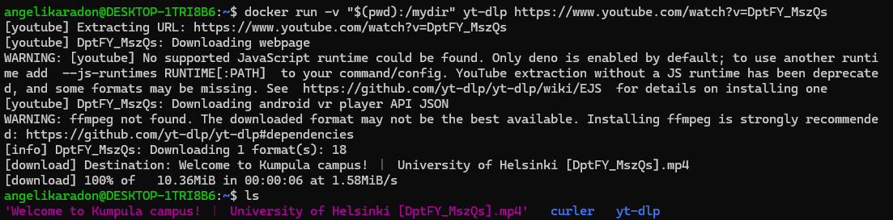
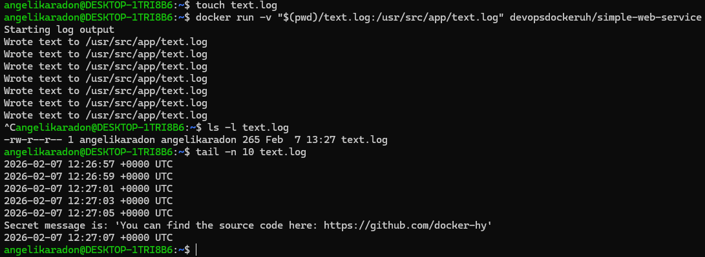

## section 5

### 1. yt-dlp – zapis pobranego pliku na hosta

Uruchomienie kontenera z podmontowaniem bieżącego katalogu jako `/mydir`, dzięki czemu pobrany film trafia bezpośrednio do systemu hosta:

```bash
docker run -v "$(pwd):/mydir" yt-dlp https://www.youtube.com/watch?v=DptFY_MszQs
```

Sprawdzenie, że plik został zapisany lokalnie:

```bash
ls
```



---

### 2. Zapisywanie logów simple-web-service na hoście

Utworzenie pustego pliku logu:

```bash
touch text.log
```

Uruchomienie kontenera z podmontowaniem pliku logu:

```bash
docker run -v "$(pwd)/text.log:/usr/src/app/text.log" devopsdockeruh/simple-web-service
```

Weryfikacja, że logi zapisywane są na hoście:

```bash
ls -l text.log
tail -n 10 text.log
```



---
