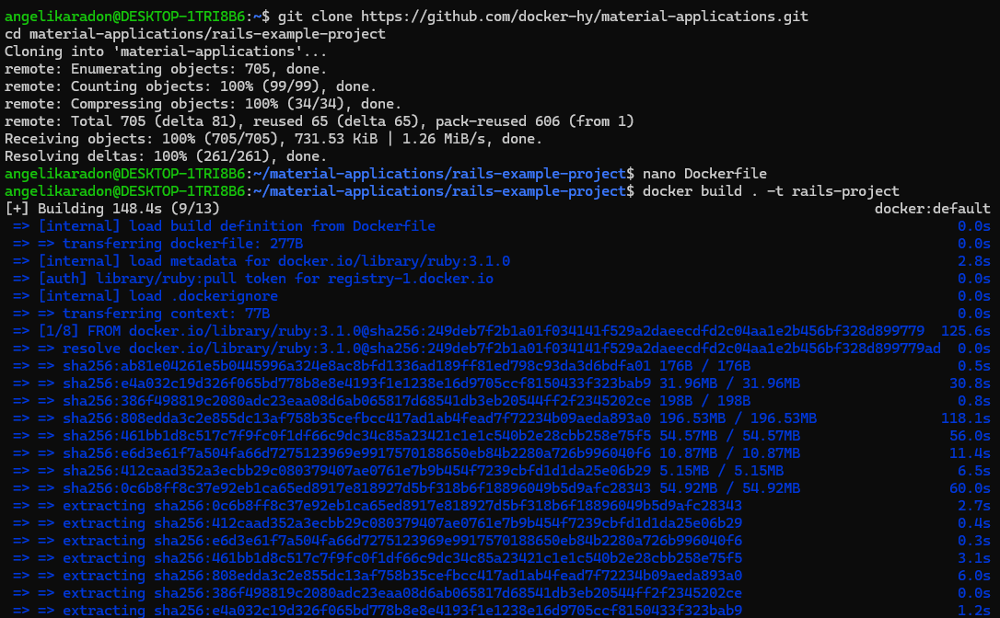
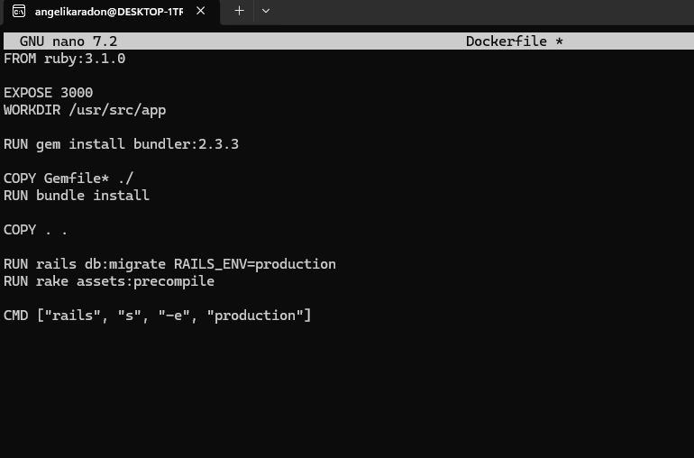
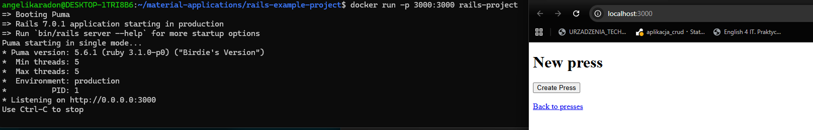
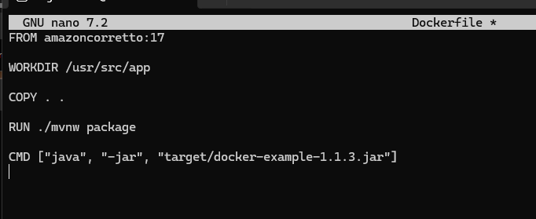
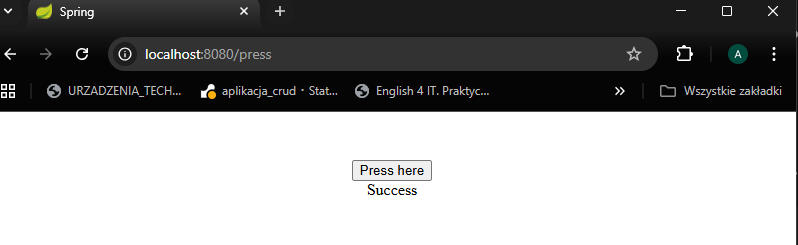
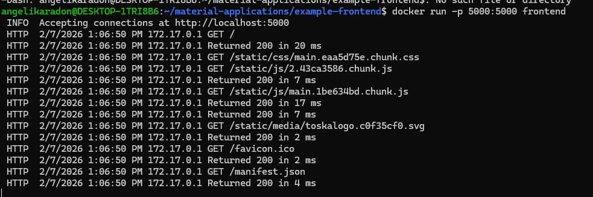
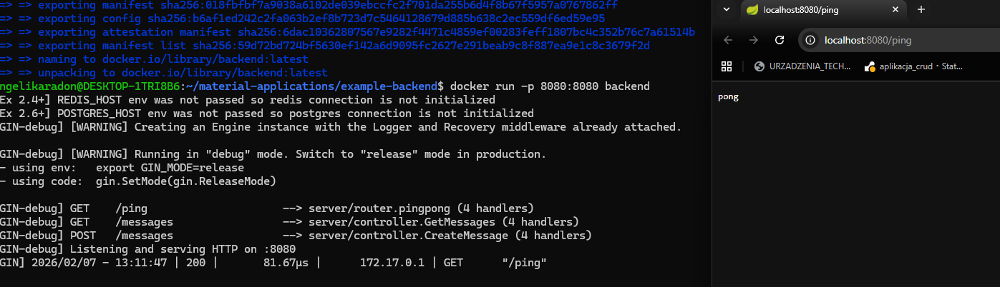
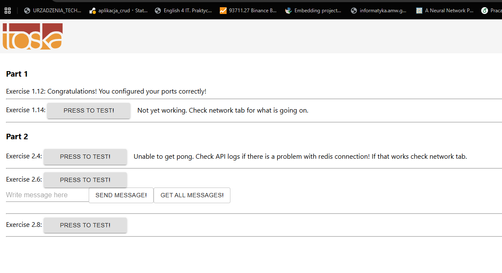

# section 6

W ramach laboratorium wykonano konteneryzację trzech projektów:
- aplikacji Ruby on Rails  
- aplikacji Java Spring  
- aplikacji frontend + backend  

Każda aplikacja została uruchomiona w kontenerze Docker na podstawie utworzonego Dockerfile.

---

## 1. Pobranie repozytorium

```bash
git clone https://github.com/docker-hy/material-applications.git
cd material-applications/rails-example-project
```



---

## 2. Aplikacja Ruby on Rails

Utworzono Dockerfile:

```bash
nano Dockerfile
```

```dockerfile
FROM ruby:3.1.0

EXPOSE 3000
WORKDIR /usr/src/app

RUN gem install bundler:2.3.3

COPY Gemfile* ./
RUN bundle install

COPY . .

RUN rails db:migrate RAILS_ENV=production
RUN rake assets:precompile

CMD ["rails", "s", "-e", "production"]
```



Budowanie i uruchomienie:

```bash
docker build . -t rails-project
docker run -p 3000:3000 rails-project
```

Aplikacja dostępna pod `http://localhost:3000`.



---

## 3. Aplikacja Spring

Przejście do projektu i Dockerfile:

```bash
cd ../spring-example-project
nano Dockerfile
```

```dockerfile
FROM amazoncorretto:17

WORKDIR /usr/src/app

COPY . .

RUN ./mvnw package

CMD ["java", "-jar", "target/docker-example-1.1.3.jar"]
```



Budowanie:

```bash
docker build . -t spring-app
```


Uruchomienie:

```bash
docker run -p 8080:8080 spring-app
```

Po wejściu na `http://localhost:8080/press` wyświetla się komunikat Success.



---

## 4. Frontend

Uruchomienie:

```bash
cd ../example-frontend
docker run -p 5000:5000 frontend
```

Aplikacja działa na `http://localhost:5000`.



---

## 5. Backend

Uruchomienie backendu:

```bash
cd ../example-backend
docker run -p 8080:8080 backend
```

Test:

```
http://localhost:8080/ping
```

zwraca:

```
pong
```



---

## 6. Wynik

Frontend i backend działają poprawnie.



---
