# Devops with docker
## Migracja do Docker Compose
**Polecenia:**
```bash
docker compose -f docker-compose.1.yml build
docker compose -f docker-compose.1.yml push
```
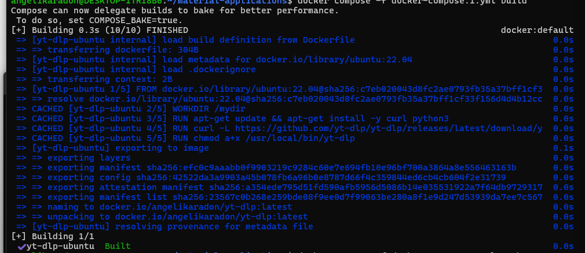

**Plik docker-compose.1.yml**
```bash
services:
  yt-dlp-ubuntu:
    image: angelikaradon/yt-dlp
    build: .
```
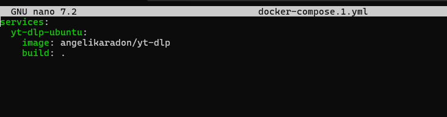

## Wolumeny w Docker Compose
**Polecenia:**
```bash
docker compose -f docker-compose.2.yml build
docker compose -f docker-compose.2.yml run yt-dlp-ubuntu https://imgur.com/JY5tHqr
```
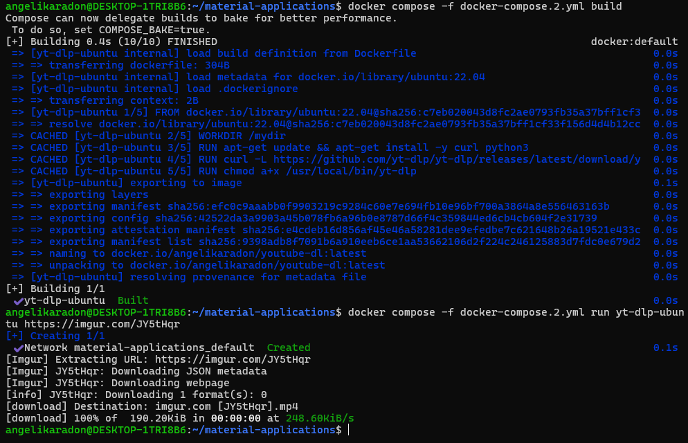

**Plik docker-compose.2.yml**
```bash
services:
  yt-dlp-ubuntu:
    image: angelikaradon/youtube-dl
    build: .
    volumes:
      - .:/mydir
    container_name: yt-dlp
```
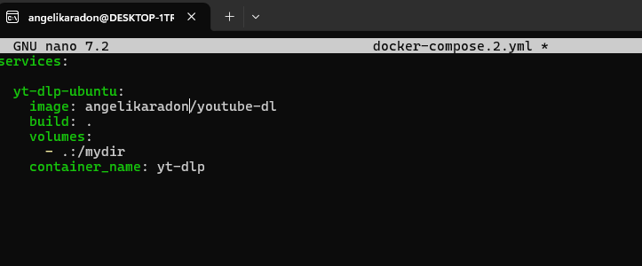

## 2.1

**Uruchomiono obraz devopsdockeruh/simple-web-service z mapowaniem pliku logów do hosta. Aplikacja zapisuje dane do /usr/src/app/text.log, które są widoczne lokalnie**
**Polecenia:**
```bash
touch text.log
docker compose -f docker-compose.3.yml up
```
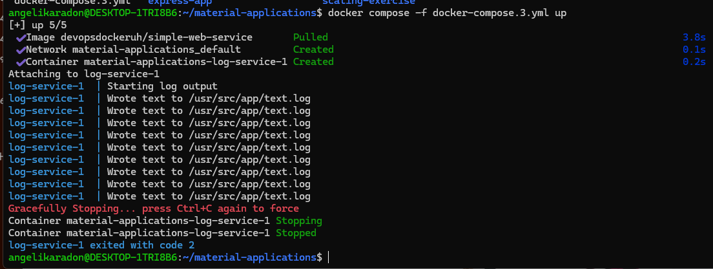

**Plik docker-compose.3.yml**
```bash
services:
  log-service:
    image: devopsdockeruh/simple-web-service
    volumes:
      - ./text.log:/usr/src/app/text.log

```
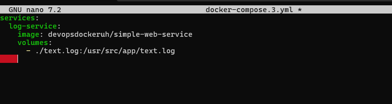

## Usługi webowe w Docker Compose - whoami

**Uruchomiono usługę testową jwilder/whoami, która zwraca identyfikator kontenera przez HTTP.**
**Polecenia:**
```bash
docker container run -d -p 8000:8000 jwilder/whoami
curl localhost:8000
docker container stop 8afda50f4a75d2e99c0f09c9b6f62b8657eb0e8e00e622ccac81bfb2938e7600
docker container rm 8afda50f4a75d2e99c0f09c9b6f62b8657eb0e8e00e622ccac81bfb2938e7600
```
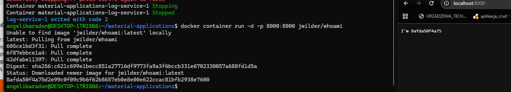

**Plik docker-compose.yml**
```bash
services:
  whoami:
    image: jwilder/whoami
    ports:
      - "8000:8000"

```

## 2.2
## Usługi webowe w Docker Compose - whoami

**W tym ćwiczeniu wykorzystano obraz `devopsdockeruh/simple-web-service` i uruchomiono go w trybie serwera HTTP przy użyciu opcji `command: server`.  Usługa została wystawiona na porcie 8080 i jest dostępna z przeglądarki.**
**Polecenia:**
```bash
docker compose -f docker-compose.4.yml up
```
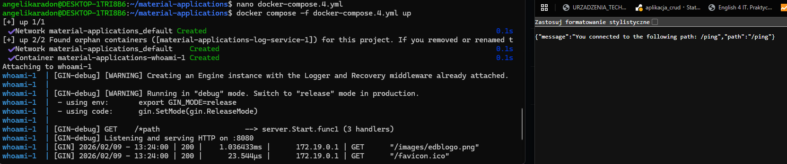

**Plik docker-compose.yml**
```bash
services:
  whoami:
    image: devopsdockeruh/simple-web-service
    command: server
    ports:
      - 8080:8080
```
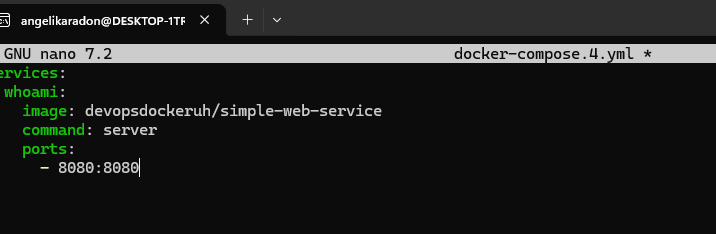
## 2.3
## Aplikacja frontend + backend w Docker Compose

**Skonfigurowano aplikację z części 1 (example-frontend i example-backend) do działania w Docker Compose. Frontend komunikuje się z backendem poprzez adres zdefiniowany w zmiennej środowiskowej, a całość jest dostępna pod adresem http://localhost:5000**
**Polecenia:**
```bash
docker compose -f docker-compose.4.yml up
```
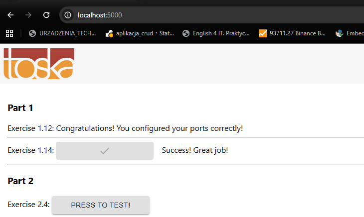

**Plik docker-compose.yml**
```bash
services:
  backend:
    build:
      context: .
      dockerfile: Dockerfile.backend
    ports:
      - "8080:8080"
    environment:
      PORT: 8080
      REQUEST_ORIGIN: http://localhost:5000

  frontend:
    build:
      context: .
      dockerfile: Dockerfile.frontend
      args:
        REACT_APP_BACKEND_URL: http://localhost:8080
    ports:
      - "5000:5000"
    depends_on:
      - backend

```
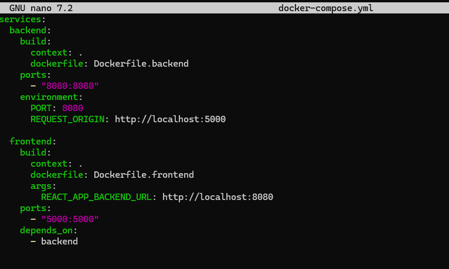
