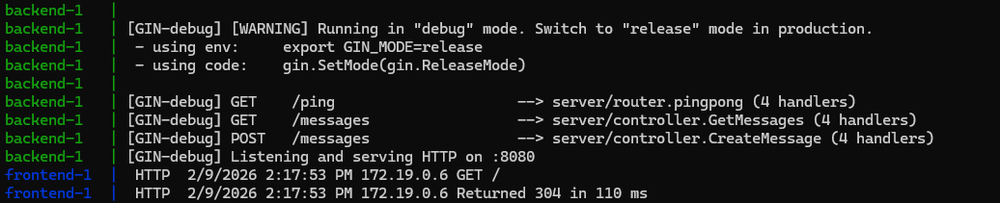
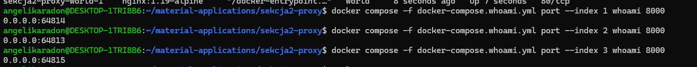
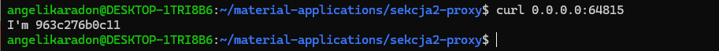
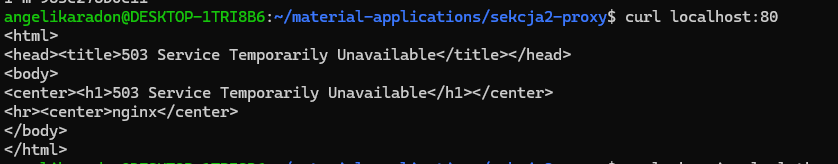
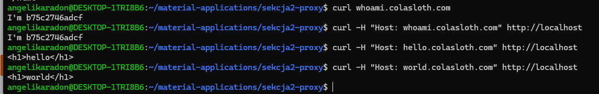
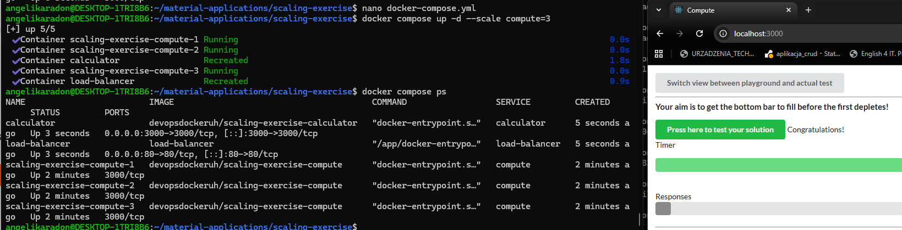

# Devops with docker
## Sieci dockera
### ćw. 2.4
**Polecenia:**
```bash
docker compose up -d --build
```



**Skalowanie**
```bash
docker-compose -f docker-compose.whoami.yml up --scale whoami=3
docker-compose -f docker-compose.whoami.yml port --index 1 whoami 8000
docker-compose -f docker-compose.whoami.yml port --index 2 whoami 8000
docker-compose -f docker-compose.whoami.yml port --index 3 whoami 8000
```




**Polecenia:**
```bash
curl localhost:80
```


**Polecenie**
```bash
curl whoami.colasloth.com
```


## 2.5

**Uruchomiono obraz devopsdockeruh/simple-web-service z mapowaniem pliku logów do hosta. Aplikacja zapisuje dane do /usr/src/app/text.log, które są widoczne lokalnie**
**Polecenia:**
```bash
docker-compose up --scale compute=3
```


