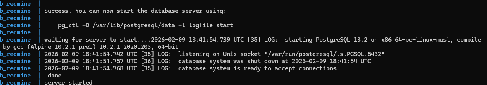
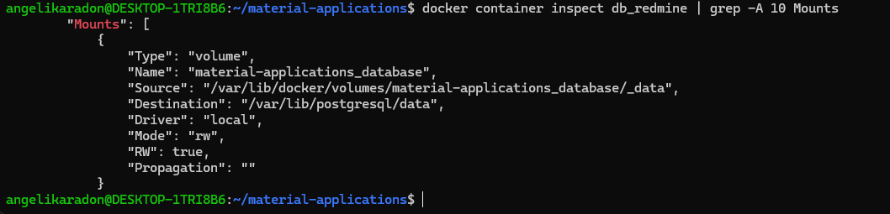
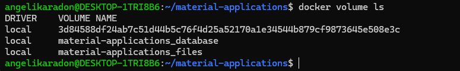
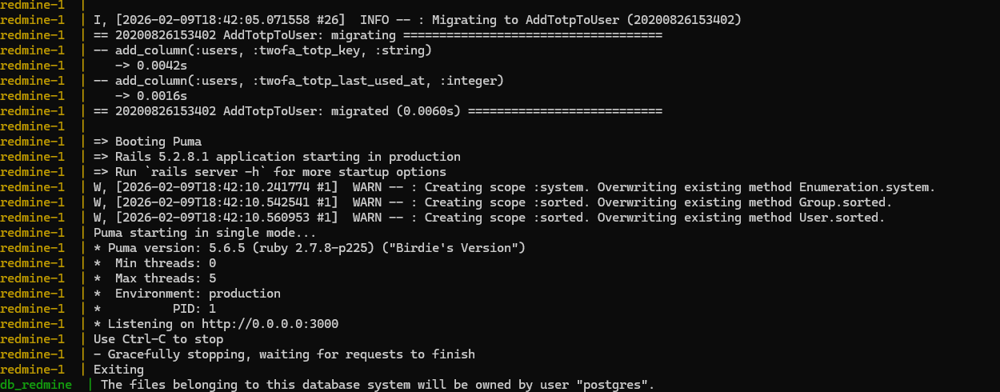
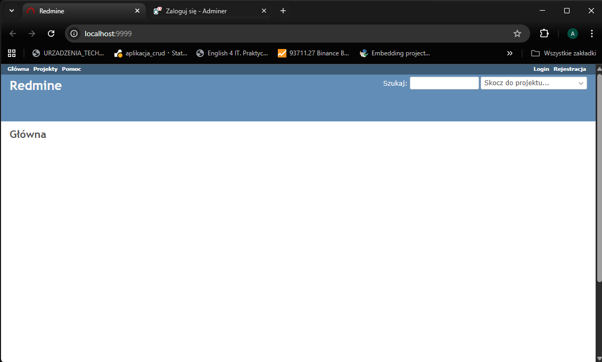
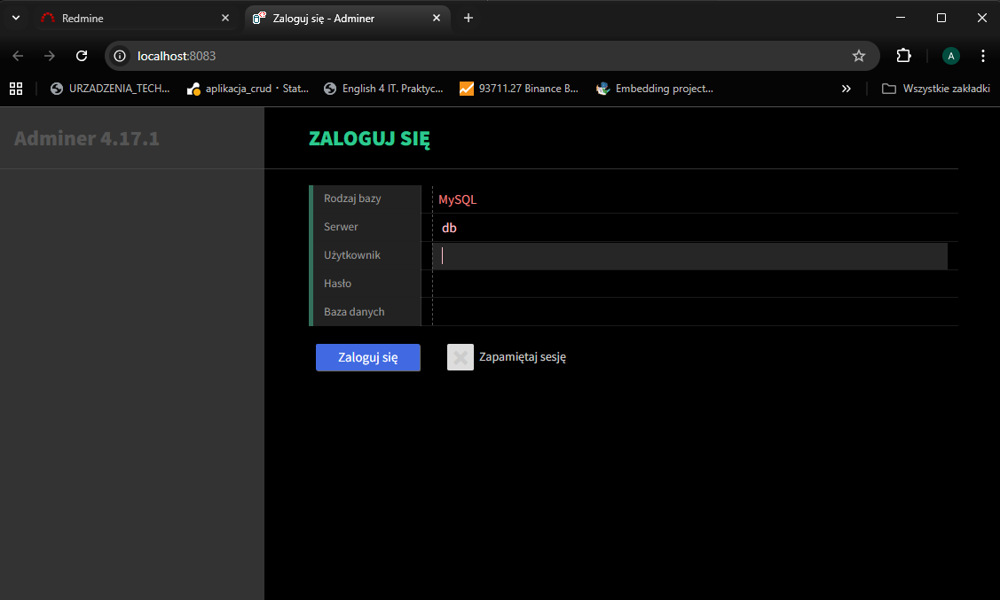
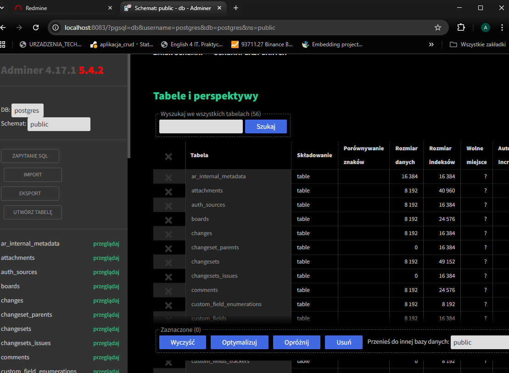
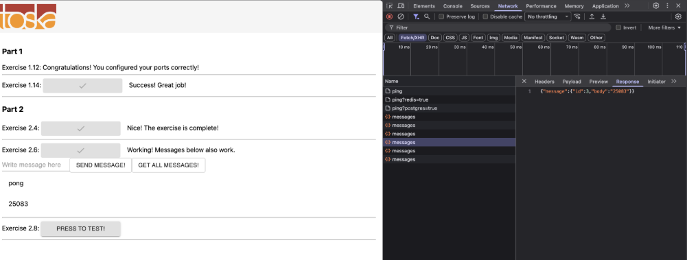
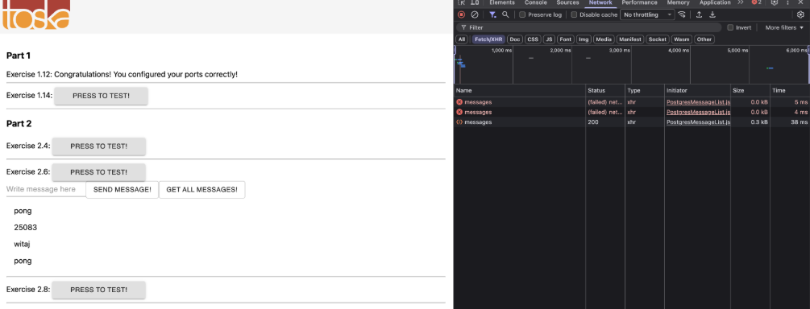

# Sekcja 3 – Wolumeny w praktyce + Docker Compose


## 1. Redmine + PostgreSQL + Adminer

### Uruchomienie

```bash
docker compose up -d
```


### Sprawdzenie wolumenów

```bash
docker container inspect db_redmine | grep -A 5 Mounts
docker volume ls
docker volume inspect material-applications_database
```




Wynik potwierdza, że baza używa wolumenu:

```bash
docker compose up
```


### Dostęp do aplikacji

- Redmine: http://localhost:9999  
- Adminer: http://localhost:8083  



Logowanie do Adminera:

- Server: db  
- User: postgres  
- Password: example  
- Database: postgres  


---

## 2. Ćwiczenie 2.6 – dodanie Postgresa do backendu


---

## 3. Ćwiczenie 2.7 – bind mount bazy



