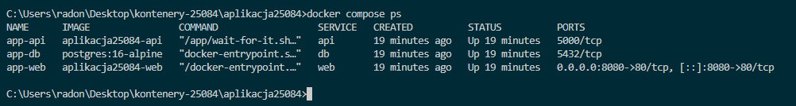
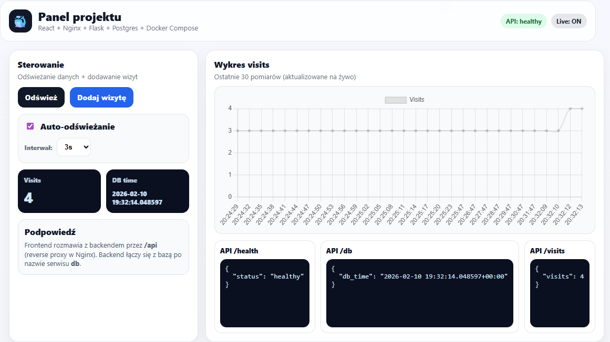
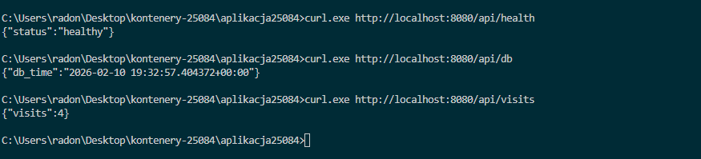
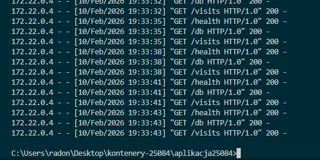
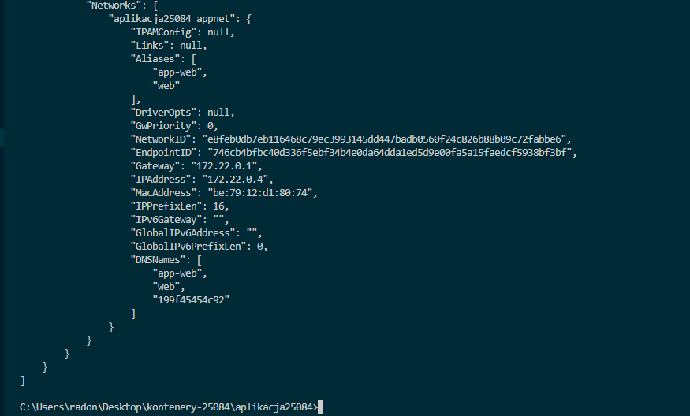
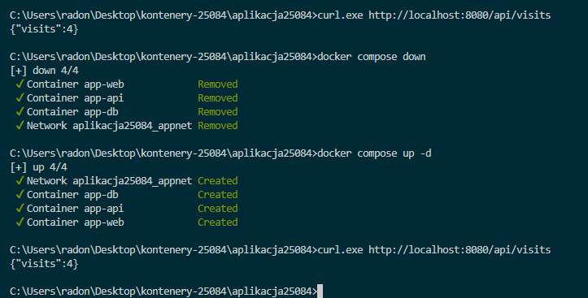
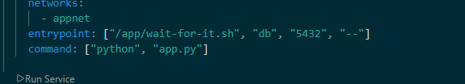
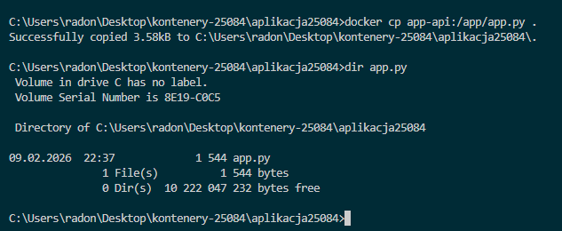
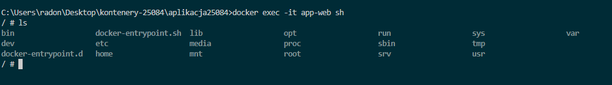

# Aplikacja25084

**Docker Hub:**
- https://hub.docker.com/r/angelikaradon/aplikacja25084-api  
- https://hub.docker.com/r/angelikaradon/aplikacja25084-web  

---

## 1. Struktura projektu

aplikacja25084/
│── docker-compose.yml
│
├── app/
│   ├── Dockerfile
│   ├── app.py
│   ├── requirements.txt
│   ├── wait-for-it.sh
│   └── .dockerignore
│
└── frontend/
    ├── Dockerfile
    ├── nginx.conf
    ├── package.json
    ├── vite.config.js
    ├── index.html
    └── src/
        ├── App.jsx
        └── main.jsx

---

## 2. Opis projektu

Projekt to aplikacja uruchamiana w trzech kontenerach:

1. web – React + Nginx  
2. api – Flask  
3. db – PostgreSQL

Przepływ:

Przeglądarka → Nginx → /api → Flask → PostgreSQL

---

## 3. Uruchomienie

W folderze projektu:

docker compose up -d --build

Otwórz w przeglądarce:

http://localhost:8080

---

## 4. Docker Hub

docker tag aplikacja25084-api angelikaradon/aplikacja25084-api:1.0
docker push angelikaradon/aplikacja25084-api:1.0

docker rmi angelikaradon/aplikacja25084-api:1.0
docker pull angelikaradon/aplikacja25084-api:1.0

---

## 5. Wymagania

ENTRYPOINT vs CMD  
- ENTRYPOINT – wait-for-it.sh  
- CMD – python app.py

Wolumen  
- dane visits zostają po restarcie

Sieci  
- api łączy się z db:5432  
- web używa /api

---

## 6. Opis zrzutów ekranu

### docker compose ps

Widoczna lista uruchomionych kontenerów:  
- app-web  
- app-api  
- app-db  
Widać mapowanie portu 8080→80 oraz że wszystkie usługi mają status „Up”.

###  aplikacja w przeglądarce

Interfejs React z wykresem Chart.js, statusem API, licznikiem visits oraz podglądem odpowiedzi z endpointów.

### test API (curl)
Wywołanie:
- /api/health  
- /api/db  
- /api/visits 

Potwierdza poprawną komunikację frontend → nginx → api → db.

### docker logs

Logi kontenera app-api pokazujące zapytania HTTP do endpointów.

### docker inspect

Fragment konfiguracji sieci:  
kontener app-web posiada adres w sieci `appnet`, widoczna wewnętrzna komunikacja Dockera.

### trwałość wolumenu

Procedura:
1. sprawdzenie visits  
2. docker compose down  
3. docker compose up -d  
4. visits pozostaje bez zmian  
→ dowód działania wolumenu PostgreSQL.

###  ENTRYPOINT i CMD

Fragment docker-compose.yml:  
- ENTRYPOINT: wait-for-it.sh (oczekiwanie na db)  
- CMD: python app.py (właściwa aplikacja).

###  docker cp

Skopiowanie pliku z kontenera na host:  
docker cp app-api:/app/app.py .

### DockerHub

Push i pull obrazu:  
angelikaradon/aplikacja25084-api:1.0  
→ dowód publikacji w repozytorium.

###  wejście do kontenera 

docker exec -it app-web sh  
Potwierdzenie dostępu do systemu plików kontenera.

