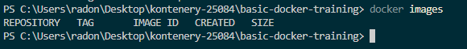

# Exercise 1: Uruchamianie kontenerów

W tym ćwiczeniu poznajemy podstawy pobierania obrazów, uruchamiania, zatrzymywania oraz usuwania kontenerów Docker.

---

## Pobieranie obrazów (Pulling an image)

Aby uruchamiać kontenery, musimy najpierw pobrać obrazy.

### Sprawdzenie dostępnych obrazów lokalnie
Sprawdzamy, jakie obrazy znajdują się aktualnie na naszej maszynie, używając polecenia `docker images`.

---

### Wyszukiwanie obrazów w DockerHub
Obrazy możemy wyszukiwać w DockerHub za pomocą polecenia `docker search`.

---

### Pobranie obrazu Ubuntu 22.04
Pobieramy obraz Ubuntu w wersji 22.04 z DockerHub.

---

### Pobranie obrazu Ubuntu 22.10
Pobieramy inną wersję tego samego obrazu – Ubuntu 22.10.

---

### Sprawdzenie obrazów po pobraniu
Ponownie sprawdzamy listę obrazów dostępnych lokalnie.

---

### Usunięcie niepotrzebnego obrazu
Usuwamy obraz Ubuntu 22.10, którego nie będziemy dalej używać.

---

### Sprawdzenie listy obrazów po usunięciu
Po usunięciu obrazu sprawdzamy ponownie listę dostępnych obrazów.

---

### Usunięcie wszystkich obrazów
Korzystamy ze skrótu do usunięcia wszystkich obrazów z systemu.

---

## Uruchamianie kontenerów (Running containers)

### Uruchomienie kontenera z poleceniem echo
Uruchamiamy kontener na bazie obrazu Ubuntu 22.04 i wykonujemy polecenie `echo`.

---

### Sprawdzenie uruchomionych kontenerów
Sprawdzamy aktualnie działające kontenery.

---

### Sprawdzenie wszystkich kontenerów (również zatrzymanych)
Wyświetlamy wszystkie kontenery, w tym zatrzymane.

---

### Uruchomienie kontenera z Bash (tryb nieinteraktywny)
Uruchamiamy kontener z poleceniem `/bin/bash` bez trybu interaktywnego.

---

### Sprawdzenie kontenerów po uruchomieniu Bash
Sprawdzamy stan kontenerów po wykonaniu polecenia.

---

### Uruchomienie kontenera w trybie interaktywnym
Uruchamiamy kontener z flagami `-it`, aby wejść do interaktywnej sesji Bash.

---

### Praca wewnątrz kontenera
Sprawdzamy aktualny katalog oraz zawartość systemu plików wewnątrz kontenera.

---

### Uruchomienie kontenera w tle (detached mode)
Uruchamiamy kontener w tle z poleceniem `sleep 3600`.

---

### Sprawdzenie działającego kontenera
Sprawdzamy, czy kontener działa w tle.

---

### Wejście do działającego kontenera (docker exec)
Dołączamy się do działającego kontenera za pomocą `docker exec`.

---

### Sprawdzenie procesów w kontenerze
Wyświetlamy listę procesów działających wewnątrz kontenera.

---

### Sprawdzenie kontenerów po wyjściu z exec
Sprawdzamy, czy kontener nadal działa po wyjściu z sesji Bash.

---

### Zatrzymanie kontenera
Zatrzymujemy działający kontener za pomocą polecenia `docker stop`.

---

### Sprawdzenie stanu kontenera po zatrzymaniu
Sprawdzamy stan kontenera po jego zatrzymaniu.

---

## Usuwanie kontenerów (Removing containers)

### Lista kontenerów przed usunięciem
Wyświetlamy listę wszystkich kontenerów przed ich usunięciem.

---

### Usunięcie kontenerów
Usuwamy zatrzymane kontenery przy użyciu polecenia `docker rm`.

---

### Automatyczne usuwanie kontenera (--rm)
Uruchamiamy kontener z flagą `--rm`, aby został automatycznie usunięty po zakończeniu działania.

