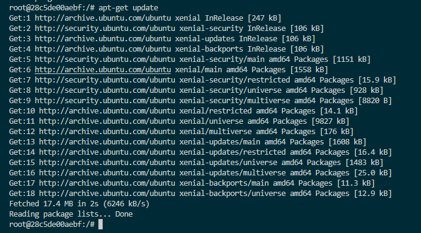
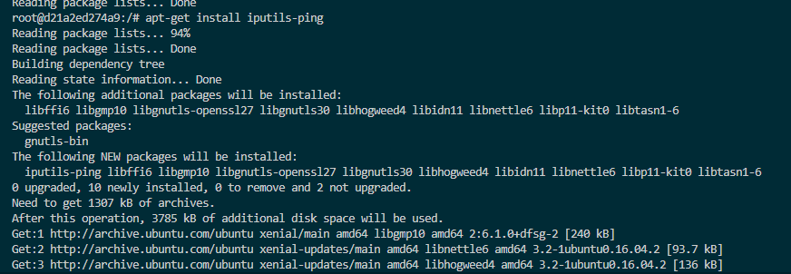

# Ćwiczenie 2 – Zmiana obrazów

W tym ćwiczeniu pokazano, jak zmodyfikować istniejący obraz Dockera,
zainstalować dodatkowe narzędzie w kontenerze oraz zapisać zmiany jako nowy obraz.

---

## Przygotowanie środowiska

### Pobranie obrazu Ubuntu 16.04
Pobranie obrazu systemu Ubuntu w wersji 16.04 z DockerHub.

**Polecenie:**
```bash
docker pull ubuntu:16.04
```


**Polecenie:**
```bash
ping google.com
```


**Polecenie:**
```bash
apt-get update
```


**Polecenie:**
```bash
apt-get install iputils-ping
```


**Polecenie:**
```bash
docker ps
```
**Polecenie:**
```bash
docker commit d21a2ed274a9 radon/ping:lates
```
**Polecenie:**
```bash
docker images
```


