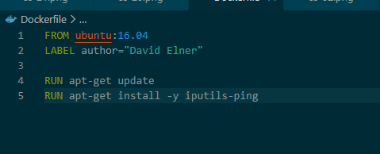
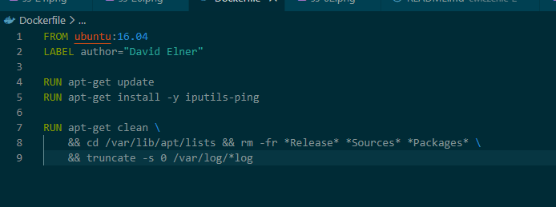

# Ćwiczenie 3 – Budowanie obrazów

Celem ćwiczenia było zbudowanie nowego obrazu Dockera na podstawie obrazu
`ubuntu:16.04` oraz dodanie do niego narzędzia `ping` przy użyciu pliku
Dockerfile.

---

## Przygotowanie środowiska

### Pobranie obrazu Ubuntu 16.04
Pobranie obrazu systemu Ubuntu w wersji 16.04 z DockerHub.

**Polecenie:**
```bash
docker pull ubuntu:16.04
```


### Sprawdzenie obrazów
**Polecenie:**
```bash
docker images
```


### Tworzenie pliku Dockerfile
**Polecenie:**
```bash
notepad Dockerfile
```


### Dodanie nagłówka do Dockerfile
**Polecenie:**
```bash
FROM ubuntu:16.04
LABEL author="David Elner"
RUN apt-get update
RUN apt-get install -y iputils-ping
```


###  Budowanie obrazu Dockera
**Polecenie:**
```bash
docker build -t radon/ping .
```


### Sprawdzenie obrazów
**Polecenie:**
```bash
docker images
```


### Optymalizacja obrazu
**Polecenie:**
```bash
RUN apt-get clean \
    && cd /var/lib/apt/lists && rm -fr *Release* *Sources* *Packages* \
    && truncate -s 0 /var/log/*log
```


### Brak poprawy
**Polecenie:**
```bash
docker images
```


### 2 Optymalizacja obrazu - poprawa
**Polecenie:**
```bash
docker images
```
