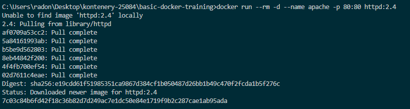
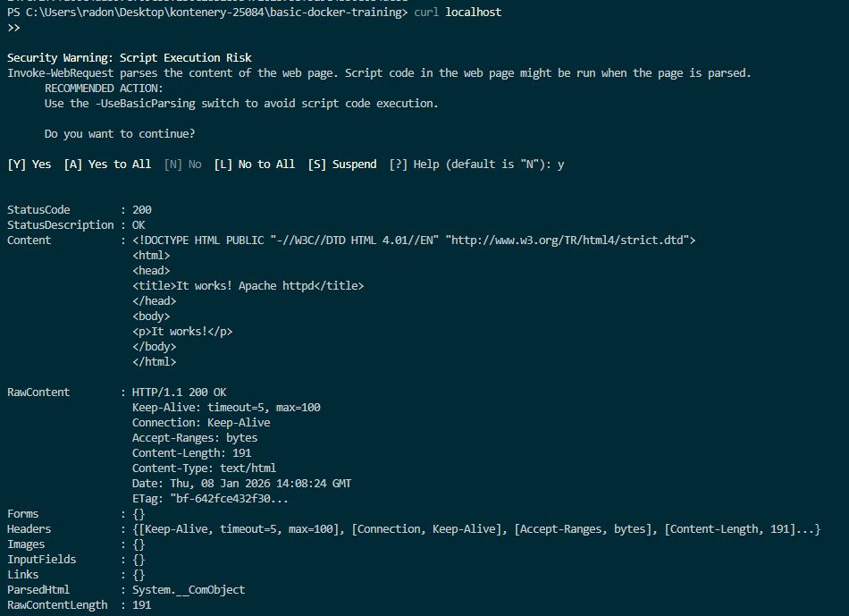
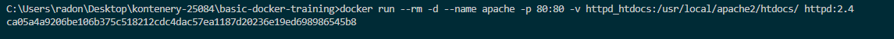
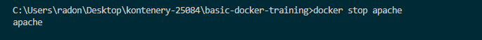
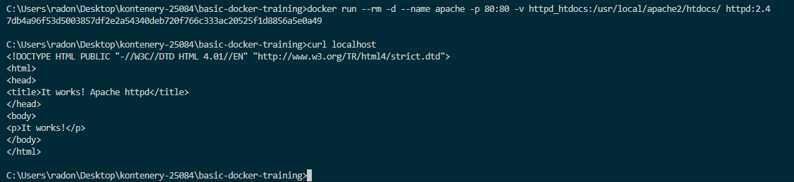

# Ćwiczenie 5 – Wolumeny

### Uruchamianie serwera

**Polecenie:**
```bash
docker run --rm -d --name apache -p 80:80 httpd:2.4
```


**Polecenie:**
```bash
curl localhost
```


**Polecenie:**
```bash
docker stop apache
docker run --rm -d --name apache -p 80:80 httpd:2.4
curl localhost
```


### Zarządzanie wolumenami
**Polecenie:**
```bash
docker volume ls
```


**Polecenie:**
```bash
docker volume create 25084volume
```


**Polecenie:**
```bash
docker volume rm 25084volume

```


**Polecenie:**
```bash
docker docker volume ls

```


### Montowanie wolumenów

**Polecenie:**
```bash
docker volume create httpd_htdocs
```


**Polecenie:**
```bash
ddocker run --rm -d --name apache -p 80:80 -v httpd_htdocs:/usr/local/apache2/htdocs/ httpd:2.4
```


**Polecenie:**
```bash
curl localhost
```


**Polecenie:**
```bash
docker stop apache
```



**Polecenie:**
```bash
ddocker run --rm -d --name apache -p 80:80 -v httpd_htdocs:/usr/local/apache2/htdocs/ httpd:2.4

curl localhost
```



**Polecenie:**
```bash
docker run --rm -d --name apache -p 80:80 -v C:\Users\radon\Desktop\kontenery-25084\basic-docker-training\ćwiczenie-5:/usr/local/apache2/htdocs/ httpd:2.4

curl localhost
```


### Porównanie z powyższym

**Polecenie:**
```bash
curl localhost
```
