# Docker for Beginners - Linux

## Task O - Prerequistes
### Klonowanie repozytorium
**Polecenie:**
```bash
git clone https://github.com/dockersamples/linux_tweet_app
```
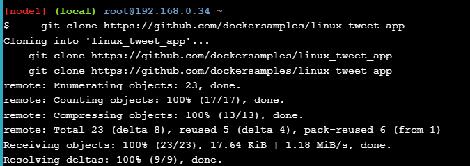

## Task 1
### Uruchamia kontener z obrazu alpine i wykonuje w nim komendę hostname
**Polecenie:**
```bash
docker container run alpine hostname
```


### Sprawdzenie kontenerów
**Polecenie:**
```bash
docker container ls --all
```

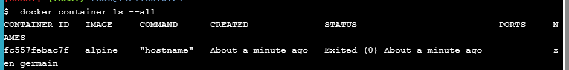

### Startuje Ubuntu,--rm usuwa kontener po wyjściu
**Polecenie:**
```bash
docker container run --interactive --tty --rm ubuntu bash
```


### Listuje katalog główny w kontenerze. Pokazuje procesy działające w kontenerze.

**Polecenie:**
```bash
ls /
ps aux
cat /etc/issue
```


### Wyjście z bash
**Polecenie:**
```bash
exit
```
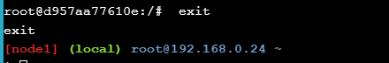

### Pokazuje wersję systemu hosta

**Polecenie:**
```bash
cat /etc/issue

```
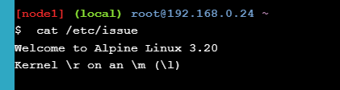

### Uruchomienie kontenera MySQL w tle

**Polecenie:**
```bash
docker container run \
  --detach \
  --name mydb \
  -e MYSQL_ROOT_PASSWORD=my-secret-pw \
  mysql:latest

```


### Pokazuje uruchomione kontenery

**Polecenie:**
```bash
docker container ls
```


### Wyświetla logi kontenera MySQL
**Polecenie:**
```bash
docker container logs mydb
```
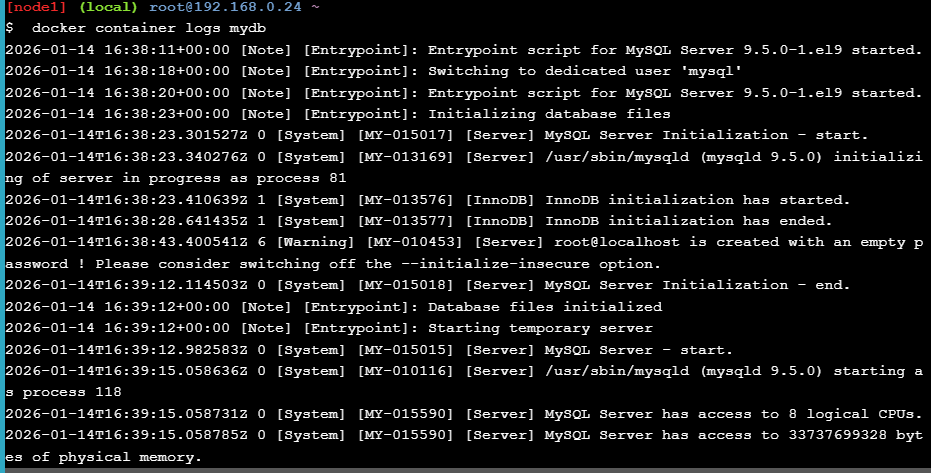

### Pokazuje procesy działające w kontenrze

**Polecenie:**
```bash
docker container top mydb
```
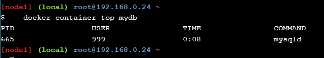

### Sprawdzenie wersji MySQL 

**Polecenie:**
```bash
docker exec -it mydb \
  mysql --user=root --password=$MYSQL_ROOT_PASSWORD --version
```
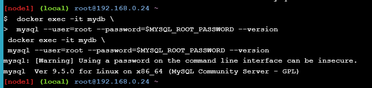

### Wejście do shella w działającym kontenerze

**Polecenie:**
```bash
docker exec -it mydb sh
mysql --user=root --password=$MYSQL_ROOT_PASSWORD --version
```


## Task 2 Task 2: Spakowanie i uruchomienie aplikacji

**Polecenie:**
```bash
cd ~/linux_tweet_app

cat Dockerfile
```


### Ustawienie DockerID w zmiennej

**Polecenie:**
```bash
export DOCKERID=angelikaradon
echo $DOCKERID

```


### Uruchomienie kontenera z NGINX i publikacja portu

**Polecenie:**
```bash
docker container run \
  --detach \
  --publish 80:80 \
  --name linux_tweet_app \
  $DOCKERID/linux_tweet_app:1.0
```


### Uruchomienie kontenera z NGINX i publikacja portu

**Polecenie:**
```bash
docker image build --tag $DOCKERID/linux_tweet_app:1.0 .
```


### Sprawdzenie


### Usunięcie działającego kontenera

**Polecenie:**
```bash
docker container rm --force linux_tweet_app
```
## Task 3

### Start aplikacji z bind mount 

**Polecenie:**
```bash
docker container run \
  --detach \
  --publish 80:80 \
  --name linux_tweet_app \
  --mount type=bind,source="$(pwd)",target=/usr/share/nginx/html \
  $DOCKERID/linux_tweet_app:1.0
```

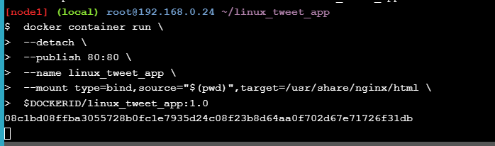

### Podmiana pliku strony  

**Polecenie:**
```bash
cp index-new.html index.html

```


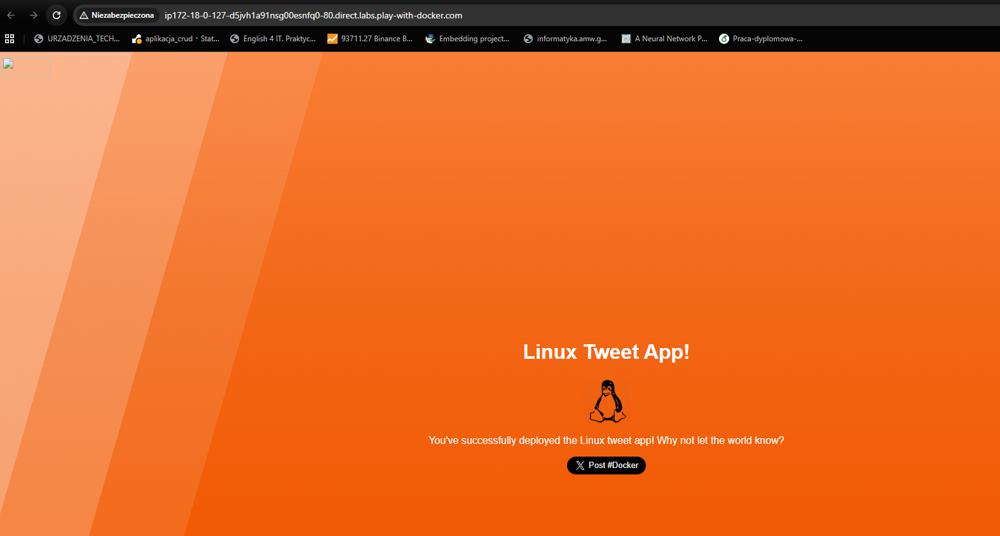

### Powrót do poprzedniej wersji 

**Polecenie:**
```bash
docker rm --force linux_tweet_app
```

**Polecenie:**

```bash
docker container run \
  --detach \
  --publish 80:80 \
  --name linux_tweet_app \
  $DOCKERID/linux_tweet_app:1.0
```
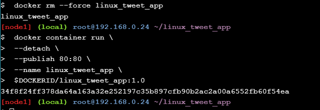

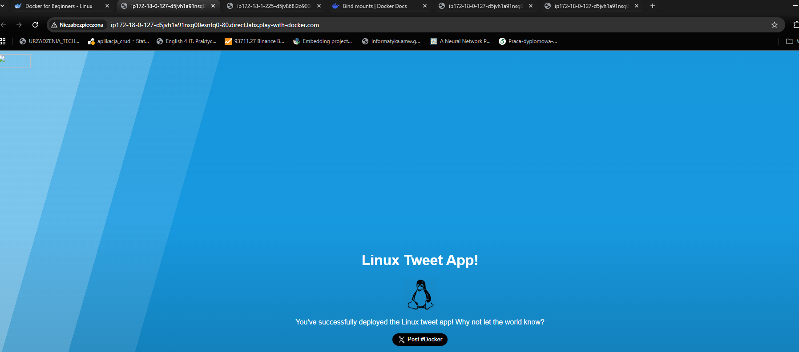

## Task 4 

### Budowa nowej wersji

**Polecenie:**

```bash
docker image build --tag $DOCKERID/linux_tweet_app:2.0 .
docker image ls

```
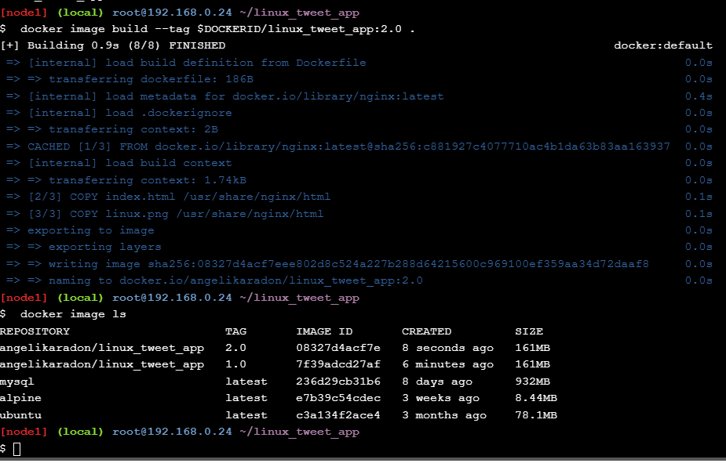

### Uruchomienie starej wersji równolegle na innym porcie

**Polecenie:**

```bash
docker container run \
  --detach \
  --publish 80:80 \
  --name linux_tweet_app \
  $DOCKERID/linux_tweet_app:2.0

```
**Polecenie:**

```bash
docker container run \
  --detach \
  --publish 8080:80 \
  --name old_linux_tweet_app \
  $DOCKERID/linux_tweet_app:1.0

```
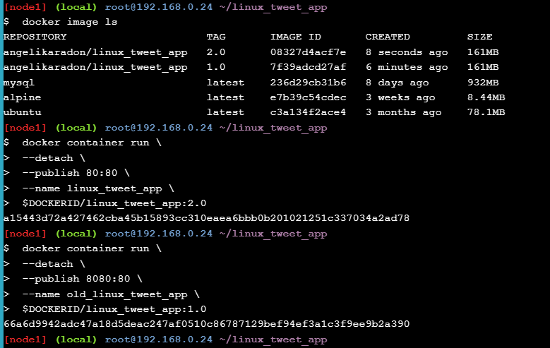


## Task 5 

### Push obrazów do Docker Hub

**Polecenie:**
```bash
docker image ls -f reference="$DOCKERID/*"

```
**Polecenie:**
```bash
docker login

```


**Polecenie:**
```bash
docker image push $DOCKERID/linux_tweet_app:1.0
docker image push $DOCKERID/linux_tweet_app:2.0

```


### Sprawdzenie

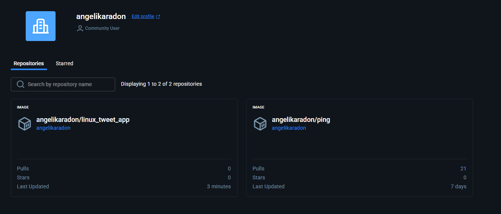

